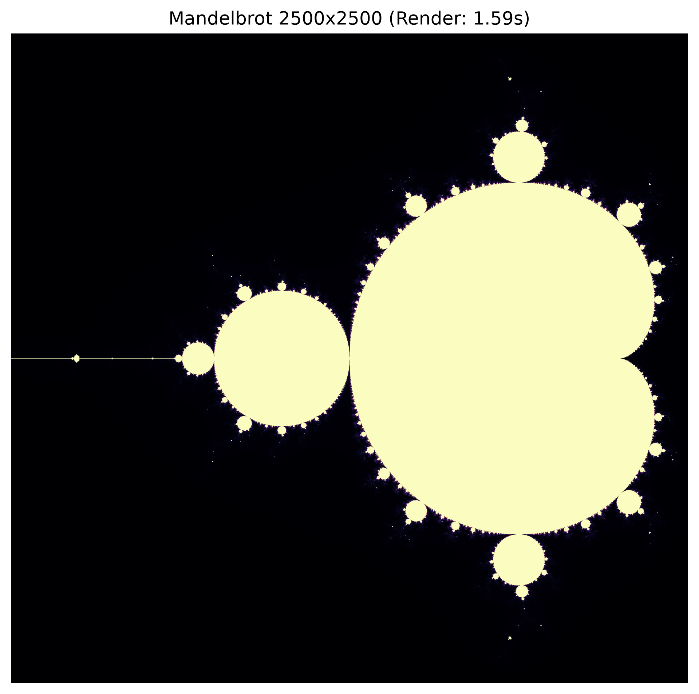

# OpenMP Multi-Core Scaling in Python

**Student:** Muslima Kosmagambetova  
**Student ID:** 230103269  
**Group:** 06P  
**CPU:** Apple M4, 10 cores  
**Date:** 01.10.2026

## Challenge 1. Monte Carlo

### Results

| Threads | Time, s | Speedup | Efficiency |
|---:|---:|---:|---:|
| 1 | 1.3028 | 1.00x | 100.0% |
| 2 | 0.6555 | 1.99x | 99.4% |
| 4 | 0.3297 | 3.95x | 98.8% |
| 8 | 0.2144 | 6.08x | 76.0% |
| 10 | 0.2456 | 5.31x | 53.1% |

Last result for pi: `3.14158853`

### Questions

**A.** The baseline time with one thread was **1.3028 s**. With the maximum number of threads (10), the time was **0.2456 s**. The best time was **0.2144 s with 8 threads**.

**B.** The warm-up call is needed because Numba compiles the function when it runs for the first time. Without warm-up, the first result would also include compilation time, so the comparison would not be fair.

**C.** The efficiency did not stay at 100%. It decreased when I used 8 and 10 threads. Parallel execution has extra scheduling and synchronization costs. Also, the Apple M4 has performance and efficiency cores, so all 10 cores do not have the same speed. In my test, 8 threads worked faster than 10.

**D.** Numba detects `inside_circle` as a reduction variable. Every thread calculates its own partial value, and after the loop these values are added together. It works like the OpenMP reduction `reduction(+:inside_circle)`, so the counter is not corrupted.

## Challenge 2. Mandelbrot

### Results

```text
Row-Parallel Render Time:    1.590 s
Column-Parallel Render Time: 1.677 s
```

### Questions

**A.** The row-parallel version was faster on my computer. It took 1.590 s, while the column-parallel version took 1.677 s. The difference was about 5.2%.

**B.** NumPy arrays use row-major memory layout. Elements from one row are located next to each other in memory. Because of this, processing a row gives better cache usage. When the program processes a column, it jumps between different memory locations, which causes more cache misses.

**C.** Different parts of the Mandelbrot image need different numbers of iterations. Many points at the top escape quickly, but points near the center can run until `max_iter`. With static scheduling, one thread can finish early while another thread is still processing a difficult part. Dynamic scheduling gives threads smaller pieces of work. When a thread finishes one piece, it can take the next one, so the load is distributed more evenly.

**D.** The generated image is saved as `mandelbrot_output.png`.



## Challenge 3. Heat Diffusion

### Results with float64

```text
Heat Diffusion Complete: 0.206 s
Throughput: 3281.37 Megacells/sec
```

### Results with float32

```text
Heat Diffusion Complete: 0.098 s
Throughput: 6907.02 Megacells/sec
```

### Questions

**A.** The runtime with `float64` was **0.206 s**, and the throughput was **3281.37 Megacells/sec**.

**B.** After changing the array type to `float32`, the runtime decreased to 0.098 s. The speed difference was:

```text
0.206 / 0.098 = 2.10
```

So the `float32` version was about **2.1 times faster**. A `float32` number uses 4 bytes, while `float64` uses 8 bytes. This means less data has to be transferred from memory, and more values can fit in the CPU cache.

**C.** The stencil calculation is limited mostly by memory bandwidth. After the memory bus reaches its limit, adding more CPU cores does not make RAM transfer data faster. The extra cores have to wait for data, so doubling the number of cores does not give a 2x speedup.

## Final Results Table

| Benchmark | Threads | Size / Samples | Time, s | Speedup | Efficiency |
|---|---:|---:|---:|---:|---:|
| Monte Carlo | 1 | 120,000,000 | 1.3028 | 1.00x | 100.0% |
| Monte Carlo | 2 | 120,000,000 | 0.6555 | 1.99x | 99.4% |
| Monte Carlo | 4 | 120,000,000 | 0.3297 | 3.95x | 98.8% |
| Monte Carlo | 10 | 120,000,000 | 0.2456 | 5.31x | 53.1% |
| Mandelbrot, rows | 10 | 2500 x 2500 | 1.590 | N/A | N/A |
| Mandelbrot, columns | 10 | 2500 x 2500 | 1.677 | N/A | N/A |
| Heat stencil, float64 | 10 | 1500 x 1500 x 300 | 0.206 | N/A | N/A |
